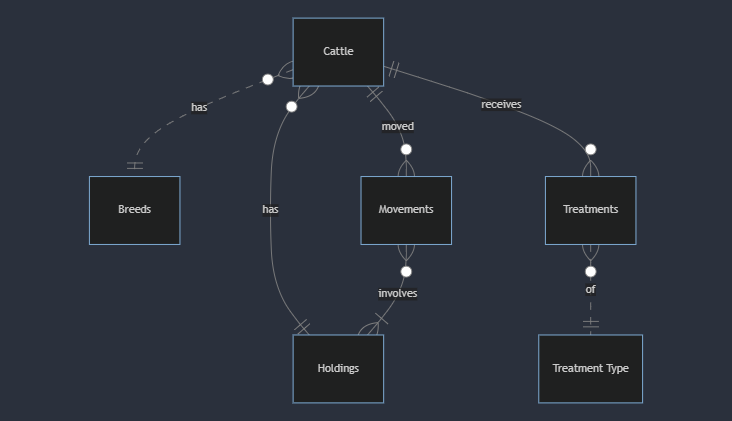

# Design Document

By Joseph Mitchell

Video overview: <URL HERE>

## Scope

This database for C7084 attempts to solve the problem in the UK cattle industry of having a centralised database that can record all the cattle in the UK as well as what medical treatments they have recieved.

In order to achieve this the following are included in the databases scope:

* Cattle, what cattle, both alive and dead, have been registered by farmers. Including information such as parentage, sex and if they are currently under withdrawal
* Breeds, what breeds of cattle have been registered
* Holdings, What premises have been registered as holding cattle
* Movements, includes information about ever movement of any animal between holdings
* Treatments, records when and what treatment any animal in the database recieves
* Treatment Types , records all possible treatments that are licienced for use in cattle

Out of scope are recording reasons for treatments, treatment success and production performance of the animals. Also out of scope is managing the movement restriction controls on holdings for disease control measures such as TB or other notifiable diseases.

## Functional Requirements

The purpose of the cattle database is to provide a centralised system for recording and managing information about cattle in the UK, including their date of birth, sex, medical treatments, current location and past movements.

The scope of the database includes cattle, breeds, holdings (premises registered for holding cattle), movements (animal movements between holdings), treatments (medical treatments received by cattle), and treatment types (licensed treatments for use in cattle).

The database does not include recording information about other livestock species, non-cattle animals, or non-medical treatments.

## Representation

Enteties are captured in SQLite tables with the following scheme.

### Entitites

The database includes the following entities

#### Cattle

The 'cattle' table includes:

* 'id', which specifies the unique ID for the cow as an 'INTEGER'. This coloumn has the 'PRIMARY KEY' constraint applied.
* 'eartag', which specifies the animals eartag as 'TEXT'. This column also has the 'NOT NULL' and 'UNIQUE' constraints applied as every animal must have a unique eartag. In addition as every eartag must follow a specified format there is the constraint to 'CHECK' the length of the entry to match the required 14 characters.
* 'breed', this specifies the ID of the breed of the animal as an 'INTEGER'. This column therefore is specified as a 'FOREIGN KEY' referencing the 'id' column in the 'breed' table.
* 'dob', this specifies the date of birth of the animal as 'TEXT' in the ISO 8601 format. This column has the 'NOT NULL' constraint applied as every animal must have a date of birth.
* 'sex', this specifies the sex of the animal as 'TEXT' which a 'CHECK' constraint applied to ensure that the animal's sex is recorded as either 'MALE' or 'FEMALE'.
* 'status', this specifies if the animal is either alive or dead as 'text'. Again this has a 'CHECK' constraint applied to ensure that the animal can only be recorded as either alive or dead.
* 'dam_id', this is an 'INTEGER' which specifys the ID of the dam of this animal. It therefore has the 'FOREIGN KEY' constraint applied, referencing the 'id' column of this 'cattle' table.
* 'sire_id', this is an 'INTEGER' which specifies the ID of the sire of this animal. It has the same constraint as 'dam_id'. 
* 'current_holding', this is an 'INTEGER' which specifies the ID of the holding that this animal is currently on. It therefore has the 'FOREIGN KEY' constraint applied, referencing the 'id' column of the holdings. Every animal must be registered to a holding and so a 'NOT NULL' constraint applied.
* 'under_withdrawal_until', this is a date stored as an 'INTEGER' type in the ISO 8601 format. It is set a 'DEFAULT' value of '0000-00-00' which implies the animal is not under meat withdrawal.

#### Breeds 

* 'id', which specifies the unique ID for the breed as an 'INTEGER'. This column has the 'PRIMARY KEY' constraint applied.
* 'breed_name', this specifies the name of the breed as 'TEXT' and has the 'NOT NULL' constraint applied.

#### Holdings

* 'id', which specifies the unique ID for the holding as an 'INTEGER'. This column has the 'PRIMARY KEY' constraint applied.
* 'CPH', which specifies the CPH of the holding as 'TEXT'. This is the identifier given to parcels of land by the APHA. In order to be a holding they must have a CPH and so the 'NOT NULL' constraint is applied. 
* 'owner', this specifies the name of the owner of the holding as 'TEXT', a 'NOT NULL' constraint is applied as every holding must have somebody responsible for it.

The 'UNIQUE' constaint is not applied to the 'CPH' and 'owner' columns as each one can be associated with more than one holding.

#### Movements

* 'id', which specifies the unique ID for the movement as an 'INTEGER'. This column has the 'PRIMARY KEY' constraint applied.
* 'cattle_id', which specifies the ID for the animal moved. This column has the 'FOREIGN KEY' constraint applied referncing the 'id' column of the 'cattle' table.
* 'from_holding', which specifies the ID for the holding the animal was moved from. This column has the 'FOREIGN KEY' constraint applied, referencing the ID column of the 'holdings' table.
* 'to_holding', which specifies the ID for the holding the animal was moved to. It has the same contraints as the 'from_holding'.
* 'date', this specifies the date that the movement took place as 'TEXT in the ISO 8601 format.

All columns are required for a movement so all columns have the 'NOT NULL' constraint applied where a 'PRIMARY KEY' constraint is not.

#### Treatments

* 'id', which specifies the unique ID for the treatment as an 'INTEGER'. This column has the 'PRIMARY KEY' constraint applied.
* 'cattle_id', which specifies the ID for the animal moved. This column has the 'FOREIGN KEY' constraint applied referncing the 'id' column of the 'cattle' table.
* 'date', this specifies the date that the movement took place as 'TEXT in the ISO 8601 format.
* 'treatment_type', this specifies the ID of the treatment that the animal received. This column has the 'FOREIGN KEY' constraint applied referencing the 'id' column of the 'treatment_types' table.

All columns are required for a treatment so all columns have the 'NOT NULL' constraint applied where a 'PRIMARY KEY' constraint is not.

#### Treatment Types

* 'id', which specifies the unique ID for the medical treatment as an 'INTEGER'. This column has the 'PRIMARY KEY' constraint applied.
* 'treatment_name', which is the name of the treatment that may be given to cattle in the UK
* 'meat_withdrawal_period', This specifies the time in days as an 'INTEGER' that following treatment a cow cannot enter the foodchain. There is a 'CHECK' constraint to ensure that the withdrawal period is >=0 as negative withdrawl periods are not possible.

All columns are required for a treatment so all columns have the 'NOT NULL' constraint applied where a 'PRIMARY KEY' constraint is not.

### Relationships

The below entity relationship diagram describes the relationships among the entities in the database.

As detailed in the diagram:

 * Each cow must be exactly one breed, it is assumed that cross bred cattle will be recorded as that breed (e.g Holstein Fresian Cross). Many cattle can be recorded as being of any breed that is registered on the system
 * Each cow must be registered as being present at exactly one holding and each holding can have 0 to many cattle on it. 0 if there are no cattle present, to many depending on the size of the herd
 * Each movement must be specific to exactly one cow, but each cow can have 0 to many movements. 0 if it is still on the holding of its birth and many if it has been moved between lots of holdings
 * Each Movement involves 2 holdings, a holding of origin and a holding of destination. Each holding can have 0 to many movements associated with it. 0 if no cattle have been moved onto it and many if more than one cow has been moved onto the holding.
 * Each cow can have 0 to many treatments, 0 if the cow has never been treated and many if it has recieved multiple treatments. Each treatment can only relate to one cow in the database as it is a record of that specific cows treatment
 * Each treatment can only be of 1 specific treatment as it is a record of that specific treatment and each treatment type can be used 0 to many times. 0 if it hasn't been used on any animal in the database and many if it has been used on multiple occasions either on one cow or different cows.

## Optimizations

One of the most important purposes of this database will be to trace movements of animals off a premises should an outbreak of a notifiable disease occur. In order to optimise this seach an index is created in the 'movements' 'from_holding' column in order to speed the identification of these off movements.

In a disease outbreak instance as well as tracing the animals that have left a holding it is important to trace animals that have moved onto the holding as a potential source of the disease and so an index is created on the 'movements' table 'cattle_id' column to expedite this query.

It will also be common to search for a list of all treatments given to an animal over the course of its life and so an index is created on the 'cattle_id' column in the 'treatments' table.

A common query will also be to list all cattle on a holding for the farmers information or for statutory measures such as TB testing which require every animal on a holding to be tested. An index is therefore created on the 'cattle' table with the 'status', 'current_holding', 'dob' and 'eartag' columns included to speed up the creation of this list of animals on a holding.

## Limitations

The main limitation of the current design of my database is that it places no controls on what movements are allowed apart from that the 'from_holding' matches the 'current_holding' that the animal is recorded as being located at. In reality there are other restrictions on movements that should be taken into account such as disease control restrictions and restrictions on moving certain ages of animals and animals that are unwell/lame.

The database relies on all treatment records being correctly input into the database in order to calculate the under_withdrawal_until data. If data fails to be input then it may lead to a food safety issue whereby animals that shouldn't enter the food chain do. The withdrawal periods can also vary by useage, for example if a drug is used differently to its licence then withdrawals as specified by the prescribing vet must be used instead of the standard withdrawals and in its current state the database would not be able to cope with this.

In order for this database to be implemented there would have to be further consideration given to user access controls. For example, farm owners may have full access to their holdings and cattle, while regulatory authorities may have read-only access or limited access based on their roles and responsibilities.
